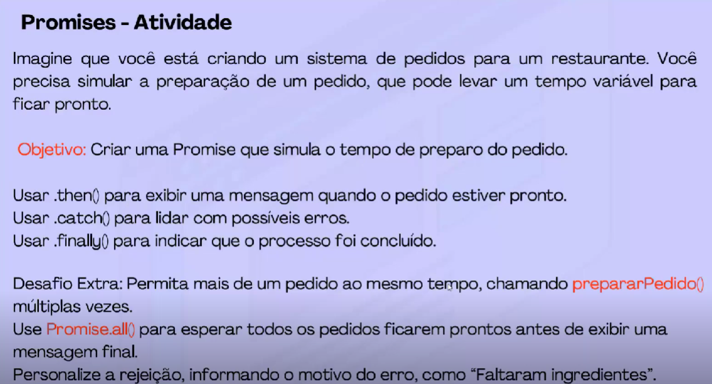

# Promises - Atividade de Estudo

Este projeto simula um sistema de pedidos para restaurante usando Promises em JavaScript.

## Como rodar o projeto

1. Certifique-se de ter o Node.js instalado.
2. No terminal, execute:

```bash
node pedidos.js
```

## Funcionamento

Ao rodar o script, será exibido um menu interativo:

```
Escolha uma opção:
1 - Executar pedidos predefinidos
2 - Inserir pedidos manualmente
> 2
Deseja adicionar:
1 - Um pedido
2 - Vários pedidos
> 2
Digite os nomes dos pedidos separados por vírgula:
> pizza de peperoni, pizza portuguesa, pizza de queijo
Pedido pronto: pizza de peperoni
Pedido pronto: pizza portuguesa
Pedido pronto: pizza de queijo
Todos os pedidos prontos!
```

- Se escolher a opção 1, o programa executa exemplos prontos.
- Se escolher a opção 2, você pode inserir um ou vários pedidos manualmente.

## Atividade Proposta


